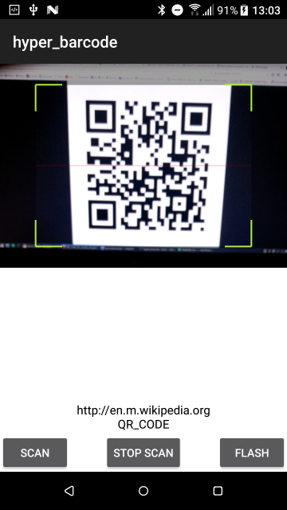

# Hyperloop.barcode

A barcode scanner example for Android using Hyperloop



## Used library:
* https://github.com/dm77/barcodescanner
* https://github.com/zxing/zxing (zxing core)

## Features:
* setFlash(true/false);
* getFlash();
* startCamera(id);
* getCamera();
* resume();
* stopCamera();
* getView();
* hasCameraPermissions();
* requestCameraPermissions(callback(true/false));


## Example:
```javascript
var scanner = require("scanner");
var whichCam = 0;

scanner.result(function(result) {
	$.lbl.text = result.getText() + "\n" + result.getBarcodeFormat();

	// just wait a bit to resume
	_.delay(function() {
		scanner.resume();
	}, 1000);
})

$.btn_start.addEventListener("click", function(e) {
	if (scanner.hasCameraPermissions()) {
		scanner.startCamera(whichCam);
	} else {
		scanner.requestCameraPermissions(function(val){
			if (val){
				scanner.startCamera(whichCam);
			} else {
				alert("Permissions needed");
			}
		});
	}
});

$.btn_stop.addEventListener("click", function(e) {
	scanner.stopCamera();

	whichCam = scanner.getCamera() + 1;
	if (whichCam > 1) {
		whichCam = 0;
	}
});

$.btn_flash.addEventListener("click", function(e) {
	scanner.setFlash(!scanner.getFlash());
});

$.index.addEventListener("open", function(e) {

});
$.view_cam.add(scanner.getView());
$.index.open();
```
